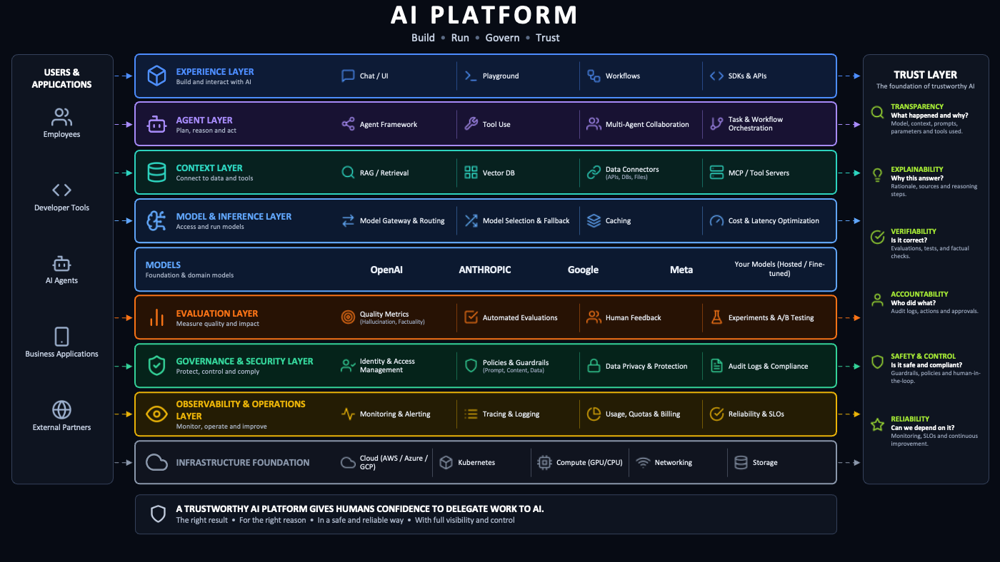

# What Is the Smallest (AI) Platform That Could Possibly Work?

Presentation content derived from
[`_explorations/what-is-the-smallest-ai-platform-that-could-possibly-work.md`](../_explorations/what-is-the-smallest-ai-platform-that-could-possibly-work.md).

- **Audience:** internal platform team and engineering leadership
- **Purpose:** introduce the question and the smallest answer I can currently
  justify, then collect reactions — especially disagreement. **This is not a
  decision meeting.** Nobody is being asked to approve or fund anything.
- **Length:** ~16 minutes, leaving most of the slot for discussion
- **Slides:** 10, plus a 4-slide appendix held in reserve
- **What the audience should leave with:** the proposal in one picture, and three
  named options they can argue with — plus a clear sense of where the reasoning is
  thin
- **Rendering format:** two PowerPoint builds of this same content —
  `…-possibly-work.pptx` (neutral dark theme, matched to the diagram) and
  `…-possibly-work-vippsmobilepay.pptx` (Vipps MobilePay corporate design:
  Off White / Dark Blue surfaces, VM Orange and VM Blue balanced, Arial as the
  sanctioned substitute for the brand fonts)

Each slide is written to stand on its own — readable without a presenter, and
usable as a document after the meeting. The *Visual* line under each slide is
guidance for generation, not slide text.

**Image asset:** `assets/images/ai_platform.png` — the full AI platform
reference architecture. It appears twice: complete on slide 5, and marked up on
slide 8. Both uses are load-bearing; see the generation notes at the end.

**The appendix exists because four slides were cut from the main line.** They
answer likely objections in more detail than the room needs unless someone
pushes. Jump to them; don't present them.

---

## Slide 1 — The question

**What is the smallest (AI) platform that could possibly work?**

The most common AI request I see is access to an LLM. Giving an engineer an API
key takes minutes and solves exactly one problem. What the key does **not** do:

- show finance which team created which cost
- help compliance understand where the data goes
- give incident response a system it can observe
- tell anyone whether the agent still works

That work arrives later — sometimes weeks after the part that felt like the job.
It lands on us, and it lands again with the next team.

Two questions for today:

1. Does that repeated work justify a platform used by several teams?
2. If it does, what is the smallest platform that could possibly work?

This is an introduction to how far I got. I am looking for reactions and
disagreement, not a decision.

*Agent, throughout: software built with LLMs, skills, and integrations with
internal or external tools.*

**Visual:** title slide. The four unanswered items as four cards, so the opening
is the contrast rather than a separate build. The register line matters — it sets
the expectation before anyone starts wondering what they are being asked to
approve.

---

## Slide 2 — No single request is a platform problem

A collection of experiments does not become a platform problem just because the
experiments use AI.

It becomes a platform problem when several teams repeatedly need the **same**
access controls, cost attribution, evaluation, observability, or audit evidence —
and solving each case separately creates more work, inconsistent controls, or
unnecessary risk.

**The test is not how much AI activity we have:**

- Does the same problem keep appearing?
- What happens if we ignore it?
- Would solving it once for several teams remove more work than it creates?

> Even when the answer is yes, the answer may be to extend a platform we already
> own. A dedicated AI platform is justified only when our existing systems cannot
> solve the repeated problem without every team rebuilding the same AI-specific
> parts.

**Visual:** the three questions as three cards, given the space the removed
bullets freed. Nothing else competes on this slide.

---

## Slide 3 — What is actually repeating for us

Two patterns, both real, both already costing us time.

**Deployment support repeats**

Analysts and product managers build something with a coding agent — often a
dashboard. It works on their machine. Making it available to others means the
company runtime and the service contract in the developer portal, which still
requires engineering experience. So we help. Manually. Again.

> Signal: the same setup and translation work returns with every new builder.

**Access without controls repeats**

Engineers build AI-powered Slack apps and ask for an LLM key. The request itself
is cheap. The key answers none of the operational questions from slide 1.

> Signal: easy access creates the same unanswered questions every time.

**Where we already stand**

The AI Playground removes part of the first pattern: a person names an agent in
the developer portal and receives a repository with a working agent deployed to
test, plus a starter prompt for a coding agent. What it removes is the repeated
setup, the allowed technologies, and the practices we want people to inherit as
skills.

That is worth naming as evidence: pattern one was real, and a **template** was
the right size of answer for it. Pattern two is the one still open — and it is
the one producing the questions from finance, compliance, and incident response.

**Visual:** two cards side by side, each with its signal line. First card marked
partially solved; second card marked open.

---

## Slide 4 — Build less than you think you need

> **The order matters.** Documentation → convention → template, library, or CLI →
> managed service. Build the service only when the simpler interventions cannot
> remove the repeated work.

Teams also repeat work because they are still learning. Centralizing too early
turns experiments into a service nobody needs.

Before building a shared service, ask whether the repeated work can be
**removed** rather than served. The apparent platform problem may be unclear
ownership, missing training, or a workflow that should not exist.

**I have paid for getting this wrong — though not with a platform.**

Manifold was an AI coding IDE for individual developers. I spent six months of
evenings on it, convinced someone needed it. Nobody did. The software was not
the problem. The problem was that I treated my own conviction as evidence that
the demand existed.

An internal platform fails the same way, but more quietly. A team that stops
using a platform rarely says so — it routes around the platform and keeps
working. We keep the mandate and lose the users, so the mandate stops being
evidence that anyone needs the thing.

> That is why I no longer trust the sentence "teams need this" when I am the one
> saying it. Everything after this slide argues for building less than I think is
> necessary.

**Visual:** the four-step escalation as a staircase, managed service at the top
and marked expensive. The Manifold block set apart as a first-person aside.

---

## Slide 5 — What a complete AI platform looks like



This is the picture most of us have in mind when someone says "AI platform."
**Build · Run · Govern · Trust.** Nine layers, from experience down to
infrastructure, serving employees, developer tools, AI agents, business
applications and external partners — with the trust layer running down the right
side.

**Nothing here is wrong.** Every box is a real capability that someone has to
provide. That is exactly what makes it dangerous as a plan: it is roughly forty
capabilities, it reads as a roadmap, and a roadmap is not evidence that we should
own any particular box.

So the question is not *which layers exist*. It is:

- Which of these do we already have, under a different name?
- Which belong to the team building the agent, not to us?
- Which are not needed yet for the workflow in front of us?
- And what is the cheapest thing that makes the trust column answerable **per
  agent**, starting today?

**Visual:** the diagram as large as the format allows, with the four questions in
a panel beside it. The per-layer capability names stay in the image — the
appendix carries them as text if anyone needs to read them out.

---

## Slide 6 — What "smallest" has to mean

Counting features, services, or lines of configuration makes a config file look
smaller than a gateway. Convenient, but not the measure that matters.

> The smallest useful AI platform is the system that creates the least total
> work, lets a defined group complete one valuable workflow, meets the minimum
> required controls, and remains cheaper to change or remove than the repeated
> work it removes.

Four tests:

- **Outcome** — can the intended user finish the job?
- **Risk** — are the minimum controls there for the possible harm?
- **Total work** — is central *and* local work reduced?
- **Change and removal** — can it be retired at an acceptable cost?

"Smallest" is the simplest thing that passes all four — for one particular
workflow.

**Visual:** the definition as a pull quote and the four tests as four short
cards. Deliberately the least crowded slide in the deck; it is the pivot from the
full picture to the proposal.

---

## Slide 7 — The proposal: a versioned agent contract

The smallest platform I can justify is a narrow service built around a
**versioned agent contract**: a configuration file stored with the code that
describes the agent and the systems it uses.

The contract alone is not the platform. The contract **and** the service are: CI
validation, connections to the systems that own operational facts, and a view in
the developer portal.

Scope for version 0.1: one simple, internal, read-only agent. Not a general
contract for every kind of agent.

```yaml
agent:
  name: settlement-explainer
  owner: payments
  purpose: explain settlement deviations
  lifecycle: experimental
  risk: internal-read-only
  allowed_data: internal
  model_access: approved-eu-provider
  runtime: application-platform
  cost_id: payments-settlement
  trace_id: settlement-explainer
  evaluation: evals/settlement.yaml
  incident_contact: payments-on-call
  disable: runbooks/disable-agent.md
```

Every field exists to make one internal, read-only workflow accountable and
observable: who owns it and why it exists, what data and models it may use,
where its runs connect to cost and traces, how it is evaluated, who to call, and
how to switch it off. If a field cannot be justified for *this* workflow, it does
not go in yet.

How it works:

1. An engineer creates or changes the agent and its contract in the same repository
2. CI validates identity, ownership, risk, data class, operational references,
   incident contact, and disable instructions
3. Delivery, evaluation, observability, and billing systems continue to produce
   and own their operational facts
4. The developer portal brings declarations, current facts, and links to their
   sources into one view
5. The agent keeps running on the existing application runtime

**No new runtime, no AI gateway, no evaluation service, no new GUI to start.**
High-impact actions, tool approvals, accepted exceptions, and retained evidence
get added when a workflow requires them.

**Visual:** YAML as the centrepiece; the five steps as a numbered column beside
it.

---

## Slide 8 — Where the platform ends: the same picture, marked up

Same diagram as slide 5. Four colors, one question per layer: **who owns this,
and do we need it yet?**

- **Contract declares it; existing systems own the facts** — governance and
  security, observability and operations
- **Declared reference; the rest waits for a signal** — model and inference,
  evaluation
- **Already have it, the team owns it, or untouched** — experience, agent,
  context, models, infrastructure

> That is the whole boundary: **one file, CI validation, and a portal view** —
> the cheapest thing on this diagram to walk away from. The other eight layers are
> already owned, belong to the team, or are waiting.

And it is what makes the trust column answerable per agent rather than in
general: transparency, accountability, verifiability and safety and control all
trace back to a declared field plus the system that owns the fact.

**Visual:** the diagram again, each layer tinted by status, everything the
contract does not touch dimmed so the lit area reads as small. The three status
lines become the legend. The per-layer detail is in the appendix.

---

## Slide 9 — The contract connects decisions. It does not enforce them.

Every shared control splits into four responsibilities:

| Responsibility | Owner |
| --- | --- |
| Decide which outcome is required | The person accountable for the harm or obligation |
| Define representative cases and evidence | The team that understands the workflow |
| Encode and validate the rule | The platform team |
| Prevent a disallowed action | A system with the context and authority to stop it |

A gateway can enforce allowed models. A deployment system can require evaluation
evidence before release. A downstream service must authorize the business action.

> A YAML file cannot stop an agent from using a credential with too much access.

Workflow-specific decisions stay with the team: model choice, prompts, business
rules, authorization, acceptance levels, alerts, and when to release or roll back.

When teams still need the same manual help, the declared information becomes
unreliable, or every system needs a custom adapter — the next addition
(generator, gateway, authorization service, evaluation service, runtime) is a
response to that signal, not a roadmap item. An AI gateway does not become
necessary because a workflow uses an LLM.

> **The condition on anything we add after the contract: it states its exit cost
> before we build it.** The same standard applies to this platform — reduce,
> replace or remove it when something simpler achieves the same result.

**Visual:** the responsibility table full width, then the YAML line as the
largest text on the slide. It is the sentence that stops the contract from being
mistaken for a control. The exit-cost condition closes the slide, because this is
where the next addition gets proposed.

---

## Slide 10 — What I don't know yet

Prototype 0.1 has one problem worth stating directly: **no team has used it.**
It is a file I wrote to find out whether the idea holds together — which is the
same kind of evidence I said on slide 4 that I no longer trust.

So the open question is not what the contract should contain. It is how a
contract nobody asked for reaches its first team. I see three ways and I do not
know which is right.

| Path | What it buys | What it costs |
| --- | --- | --- |
| **Put it in the template** | Fastest adoption. Every agent generated through the internal template gets a contract by default; teams receive it without asking | Nobody chose it. The adoption numbers would look good and mean nothing — the exact failure mode from slide 4. And if CI validates it and audit recognition depends on it, no team can ship without one |
| **Wait for the pull** | Real demand. We build when a team asks for something it enables: cost attribution, audit evidence, or a way to disable an agent during an incident | The request arrives after agents are already in production — the most expensive moment to introduce a contract, and the least likely to get engineering time |
| **Don't build it** | Cheapest. Add the fields to the service contract the developer portal already uses. No new system to own, nothing to leave | Puts AI-specific facts into a system that was not designed for them. Unclear whether that is reuse or a problem that grows slowly |

> The first option is the one I want to pick, and wanting it is the reason I have
> not.

**What would help me most:** which of the three would you pick — and where does
it break in your team's context? A concrete objection is worth more to me than
agreement.

**What would change my mind:** a team that was handed a contract by default and
actually used it. If anyone here has been further along on this before — which
path did you choose, and what did it cost?

**Visual:** three columns with the cost line emphasized over the benefit line.
Do not visually rank them. Nothing on this slide should look like a
recommendation waiting for approval.

**Missing on purpose:** none of the three paths carries an effort estimate. If
someone asks what each one costs in engineering time, the honest answer today is
that I don't know yet.

---

# Appendix

Not presented. Each of these answers one likely objection in more detail than the
main line needs.

## A1 — Nine layers, capability by capability

*Use when someone wants the full picture read out rather than shown.*

| Layer | What it provides |
| --- | --- |
| **Experience** | Chat/UI, playground, workflows, SDKs and APIs |
| **Agent** | Agent framework, tool use, multi-agent collaboration, task orchestration |
| **Context** | RAG/retrieval, vector DB, data connections, MCP and tool servers |
| **Model & inference** | Model gateway and routing, model selection and fallback, caching, cost and latency optimization |
| **Models** | OpenAI, Anthropic, Google, Meta, our own hosted or fine-tuned models |
| **Evaluation** | Quality metrics, automated evaluations, human feedback, experiments and A/B testing |
| **Governance & security** | Identity and access management, policies and guardrails, data privacy, audit logs and compliance |
| **Observability & operations** | Monitoring and alerting, tracing and logging, usage/quotas/billing, reliability and SLOs |
| **Infrastructure** | Cloud, Kubernetes, GPU/CPU compute, networking, storage |

The trust layer spans all of them: transparency (what happened and why),
explainability (why this answer), verifiability (is it correct), accountability
(who did what), safety and control (is it safe and compliant), reliability (can
we depend on it).

> A trustworthy AI platform gives humans confidence to delegate work to AI: the
> right result, for the right reason, in a safe and reliable way, with full
> visibility and control.

## A2 — Which system owns each fact

*Use when asked whether the contract becomes a second source of truth.*

| Kind of fact | Examples | Source |
| --- | --- | --- |
| Declared with the code | Purpose, owner, lifecycle, risk class, allowed data, model-access reference, incident contact | Agent contract |
| Observed while building or running | Deployed revision, evaluation result, traces, cost | CI, delivery, evaluation, observability, billing |
| Confirmed by an accountable owner | Approval, accepted exception, review decision, expiry | The system where that decision is made |

A developer portal can combine these facts into one view without copying all of
them into the repository. The contract carries identifiers and requirements; the
original systems remain responsible for the current state.

## A3 — Status of every layer for version 0.1

*Use when asked to justify the boundary layer by layer.*

| Layer | Status for version 0.1 |
| --- | --- |
| **Experience** | Already have it. The Playground covers the entry point; the product surface belongs to the team |
| **Agent** | Team owns it. Framework, tool use, orchestration. The contract only declares identity, purpose, owner and lifecycle |
| **Context** | Team owns it. Retrieval, vector stores, data connections. The contract declares the allowed data class, not the wiring |
| **Model & inference** | Declared reference + deferred. The contract points at approved model access. Gateway, routing, fallback and caching wait for a signal |
| **Models** | External. Approved provider and region are a declared reference, not something we build |
| **Evaluation** | Reference now, runner later. The domain team defines the cases, the possible harm, and what is good enough to release |
| **Governance & security** | Existing systems + contract. Our identity platform issues identities; the resource owner authorizes business actions. CI validates the declarations |
| **Observability & operations** | Existing systems + identifiers. Observability and billing own the data; the contract carries the trace and cost identifiers |
| **Infrastructure** | Untouched. The existing application runtime and cloud. We introduce no new runtime |

## A4 — The trust column, answered per agent

*Use when asked what the contract actually buys.*

| Trust property | What makes it answerable | Who answers it |
| --- | --- | --- |
| Transparency | Declared purpose, model access, data class, runtime | Contract |
| Accountability | Declared owner and lifecycle; approvals and exceptions | Contract + the deciding system |
| Verifiability | Evaluation reference | Contract + evaluation system |
| Safety & control | Risk class, allowed data, incident contact, disable instructions | Contract + enforcing systems |
| Reliability | Trace and cost identifiers | Contract + observability and billing |
| Explainability | Sources and reasoning steps | The team's product, not the platform |

---

## Notes for whoever generates the deck

**The image**

- Source: `assets/images/ai_platform.png` (repo root). From this folder:
  `../assets/images/ai_platform.png`.
- Slide 5 shows it complete and unmodified. Slide 8 shows it again with layers
  tinted by status. Showing the *same* image twice is the argument — a second,
  differently drawn diagram breaks it.
- Alt text: "AI platform reference architecture. Nine layers from experience down
  to infrastructure, between a column of users and applications on the left and a
  trust layer on the right."
- The diagram is dark-background. Match the deck to it rather than placing it on
  white.

**Structure**

- **The register is introduction, not proposal.** The room is not approving,
  funding, or choosing anything. Every ask is for a reaction: which option, what
  breaks, what it cost you. Nothing should read as a recommendation awaiting sign-
  off — if a slide starts to, the deck has drifted.
- Slide 4 and slide 10 carry the argument. The Manifold mistake is the reason the
  proposal is small, and slide 10 is what the meeting is *for* — the three open
  options are the thing being handed to the room. Protect both.
- Slide 5 → 6 → 7 → 8 is one movement: the full picture, the measure, the
  proposal, the marked-up picture. Keep them adjacent and in that order.
- The boundary argument is made **once**, visually, on slide 8. Earlier drafts
  made it four times — diagram, layer table, enforcement, trust mapping. Three of
  those are now A3, A4 and a compressed slide 9. Do not promote them back.
- **Freedom is not its own slide, on purpose.** An earlier draft had one, with an
  exit checklist, a migration budget and a parallel-run plan. All of that is
  written for the platform on slide 5, not for a YAML file in the team's own
  repository — leaving version 0.1 is deleting a file and turning off a CI check.
  The slide argued against itself. What survives is the part that is not about
  size: the contract is the cheapest thing on the diagram to leave (slide 8), any
  later addition states its exit cost first (slide 9), and a default that CI
  enforces is still a mandate (slide 10). Do not rebuild the slide.
- Do not add a summary slide after slide 10, and do not add a "next steps" or
  "recommendation" slide. Ending on the three open options is the point — it is
  what makes the room able to answer. A closing conclusion turns an introduction
  into a pitch.
- The tone is first person and provisional: "the smallest platform I can
  justify," not "the recommended architecture." Keep the hedges — they are the
  argument, not padding.
